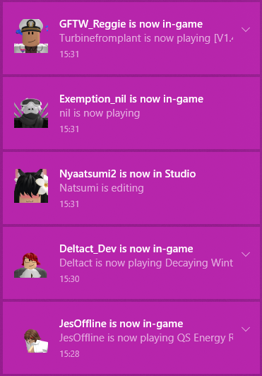

# Bloxtivity
Live notifications about your friend's activity on Roblox! Works on Windows and Linux.

	

## Building and running

### GitHub Actions

TODO

### Manually

1. Run `npm install` to install dependencies.
2. Copy the `.env.example` file to `.env` and replace `REPLACE_THIS_WITH_YOUR_ENTIRE_TOKEN` with your `.ROBLOSECURITY` cookie token.
3. Run `npm run build` to build the Bloxtivity.
4. Run `npm run bloxtivity` to start Bloxtivity.

## To-do list

- [x] Improve CSRF token generation and handling
- [ ] Do not display profile picture if it's too large to be handled by Windows
- [ ] Join game instance button
- [ ] View game page button
- [ ] Make cache useful/Compare checksums
